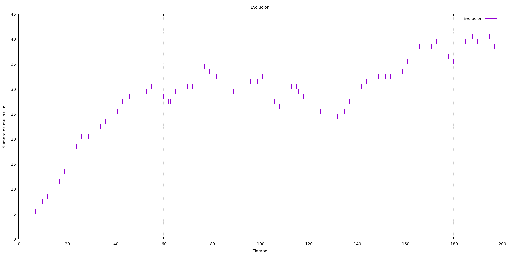

# fisicacomputacional2
Repositorio para archivos, metodos y tareas de fisica computacional 2 UFRO

Tarea 1:

Problema2:

Problema3:

Tarea 2:

Animacion de Problema 1:

Animacion de Problema 4:

Proyecto Final:

Modelo de Ehrenfest:

